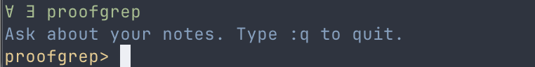

# proofgrep

`proofgrep` is a small local Zig CLI for searching proof notes, math notes, and related text files without standing up a service.

It is intentionally simple:
- launch it with `proofgrep`
- ask a question and get the best matching snippets
- keep `find` for plain grep-style search
- works on `.md`, `.tex`, `.lean`, `.txt`, `.typ`, and `.sty`
- built in Zig
- uses `ripgrep` for the `find` subcommand
- Nord-themed terminal output when writing to a TTY
- respects `NO_COLOR` and `FORCE_COLOR`

## Launch

Interactive mode:

```sh
proofgrep
```

After results appear in interactive mode, type a result number like `1` to open that file in `nvim`.
If `nvim` is not available, `proofgrep` falls back to `$EDITOR`, then to the platform opener.

One-shot question:

```sh
proofgrep ask "What do my notes say about Navier-Stokes?"
```

Plain search:

```sh
proofgrep find theorem ~/Developer/logicbox --type tex --context 1
```

By default, `ask` and interactive mode search these roots if you do not pass paths:
- `~/ObsidianVault`
- `~/Developer/latex`
- `~/Developer/logicbox`
- `~/Documents/latex`

By default, multi-word `find` queries use flexible matching, so `"navier stokes"` also matches `Navier-Stokes`.
Use `--literal` if you want exact text matching.

Set `NO_COLOR=1` to force plain output.
Set `FORCE_COLOR=1` to keep color even when piping.
The first launcher run builds the Zig binary automatically if needed.

## Screenshot


